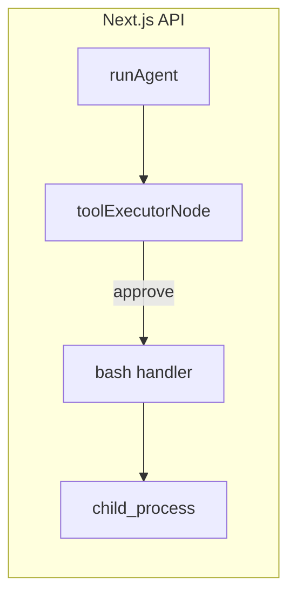

# Plan: herramienta Bash (servidor, one-shot)

## Contexto de arquitectura

El agente se ejecuta en Node dentro de la API (`[apps/web/src/app/api/chat/route.ts](apps/web/src/app/api/chat/route.ts)`) llamando a `[runAgent](packages/agent/src/graph.ts)`. No existe hoy ningún puente al terminal del IDE; los comandos correrán en **el mismo proceso/host que sirve Next.js** (útil en desarrollo local o despliegue self-hosted con control del servidor).

## Comportamiento acordado (MVP)

- **Inputs**: `terminal` (string, opcional): identificador lógico para correlación y logs; no implica PTY ni shell persistente en esta versión.
- **Inputs**: `prompt` (string, obligatorio): comando ejecutado como `bash -lc` (equivalente Unix: `bash -c` con login shell).
- **Proceso**: tras aprobación HITL (riesgo `high` → `[toolRequiresConfirmation](packages/types/src/catalog.ts)`), ejecutar un comando one-shot y devolver stdout/stderr y código de salida como texto/JSON en el `ToolMessage`.
- **Working directory**: por defecto `process.cwd()` del servidor, o override opcional vía env (ver abajo). No se persiste `cwd` entre llamadas salvo que más adelante se amplíe el diseño.

## Riesgo y confirmación

- `risk: "high"` en el catálogo → el flujo existente en `[toolExecutorNode](packages/agent/src/graph.ts)` ya pide confirmación antes de invocar la herramienta.
- Añadir un caso en `[buildConfirmationMessage](packages/agent/src/graph.ts)` para `bash` que muestre un resumen seguro (p. ej. truncar `prompt` largo) y el `terminal`.

## Guardrails recomendados (fail-closed)

- **Feature flag**: si `BASH_TOOL_ENABLED` no es `true`, el handler devuelve un error claro en el resultado (sin lanzar excepción no controlada). Así los despliegues donde no se quiera shell quedan desactivados por defecto.
- `**BASH_TOOL_CWD`** (opcional): directorio de trabajo absoluto; si falta, usar `process.cwd()`. Validar que la ruta exista y sea directorio; si no, error explícito.
- **Límites de ejecución**: `timeout` razonable (p. ej. 60–120 s), `maxBuffer` acotado (p. ej. varios MB) para evitar bloqueos y memoria desbordada.
- No añadir listas negras heurísticas de comandos en el MVP (difíciles de mantener); la confianza recae en HITL + flag + control de despliegue.

## Archivos a tocar

| Área            | Archivo                                                                            | Cambio                                                                                                                                                                                                                                                                 |
| --------------- | ---------------------------------------------------------------------------------- | ---------------------------------------------------------------------------------------------------------------------------------------------------------------------------------------------------------------------------------------------------------------------- |
| Catálogo        | `[packages/types/src/catalog.ts](packages/types/src/catalog.ts)`                   | Nueva entrada `id`/`name` `bash`, `risk: "high"`, `parameters_schema` con `terminal` y `prompt`, textos `displayName`/`displayDescription` en español alineados al resto.                                                                                              |
| Zod             | `[packages/agent/src/tools/schemas.ts](packages/agent/src/tools/schemas.ts)`       | `bash: z.object({ terminal: z.string(), prompt: z.string() })` (límites `.max()` opcionales en `prompt` para evitar prompts gigantes).                                                                                                                                 |
| Runtime         | `[packages/agent/src/tools/adapters.ts](packages/agent/src/tools/adapters.ts)`     | Importar ejecutor; registrar `TOOL_HANDLERS.bash`.                                                                                                                                                                                                                     |
| Ejecución       | **Nuevo** `packages/agent/src/tools/bashExec.ts` (nombre orientativo)              | `execFile`/`spawn` con `bash -lc`, capturar stdout/stderr, exit code; aplicar env, timeout, maxBuffer; devolver objeto serializable (p. ej. `{ terminal, stdout, stderr, exitCode }`).                                                                                 |
| UX confirmación | `[packages/agent/src/graph.ts](packages/agent/src/graph.ts)`                       | `case "bash"` en `buildConfirmationMessage`.                                                                                                                                                                                                                           |
| Onboarding      | `[apps/web/src/app/onboarding/wizard.tsx](apps/web/src/app/onboarding/wizard.tsx)` | Incluir `"bash"` en el array `TOOL_IDS` usado en `handleFinish`, igual que el resto de herramientas persistibles (hoy el array no incluye todos los del catálogo; al menos `bash` debe estar en la lista para que el toggle del paso “Herramientas” guarde el estado). |
| Docs de entorno | `[apps/web/.env.example](apps/web/.env.example)`                                   | Documentar `BASH_TOOL_ENABLED` y `BASH_TOOL_CWD`.                                                                                                                                                                                                                      |

No hace falta migración SQL: las herramientas se habilitan por fila en `user_tool_settings` y el UI ya itera `[TOOL_CATALOG](apps/web/src/app/settings/settings-form.tsx)`.

## Pruebas manuales sugeridas

- Con `BASH_TOOL_ENABLED=true`, herramienta habilitada en ajustes, y comando de bajo riesgo tras confirmar en UI: ver salida esperada.
- Con flag desactivado: mensaje de error claro en el resultado de la herramienta.
- Confirmar que sin aprobar la interrupción HITL no se ejecuta `child_process`.

## Limitación explícita para el usuario

En producción serverless o multi-instancia, **no** hay “terminal persistente” compartido entre requests; el `terminal` id en MVP es correlación y trazabilidad, no una sesión OS real. Una evolución futura sería PTY + mapa de sesiones en un solo proceso largo o un worker dedicado.